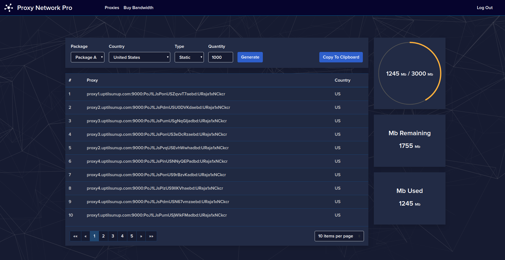

# Proxy Generation Dashboard

This is the user facing proxy url generation dashboard for the wordpress plugin Proxy Network Pro.

https://proxynetworkpro.com

Proxy Network Pro let's you setup your own proxy network by reselling proxies from any provider.

With Proxy Network Pro you can create residential and datacenter proxy networks.

Here is an example of what the proxy gen dashboard looks like. You can of course customize the look to your liking.

## Custom Production Build

This is an angular app.

To create a custom production build, you can run 'npm run build:prod:custom'

You will need to change the build script a bit for you environment.

The full script in package.json looks like this:

"ng build --prod=true --aot=true --deploy-url='/wp-content/themes/pnp-theme/pnp/app/' && node ./wpMove.js '../pnp-theme/pnp/app'",

Let's break it down.

The --deploy-url arg needs to be changed to /wp-content/themes/YOUR-THEME-HERE/pnp/app/ 
Replace 'YOUR-THEME-HERE' with the directory name for your theme (on the server).

The --deploy-url argument is so that angular knows where to load other js bundles from on the server.
If this is not set correctly, you'll see 404 errors in the console in the browser.

The PNP Wordpress plugin checks to see if the directory your-theme/pnp/app exists.

If so, it loads the app from that directory instead of the copy supplied with the plugin.

You'll need to create the pnp/app directory in your theme folder yourself.

We recommend using a child theme so that theme update don't wipe out your customizations.

After the build is complete, the build files will be moved to the argument supplied to the wpMove.js script.
This is just a convenience, so the files can be moved wherever you want after build.

## Build Watch (Local Wordpress Development)

The 'build:watch' script in package.json is for local wordpress development.

It will build the app as you make changes, and you can refresh your wordpress page in your browser to see the changes immediately.

The full script in package.json looks like this:

"node ./preBuildWatch.js '../pnp-theme/pnp/buildWatch' && ng build -c localwpwatch --watch --deploy-url='/wp-content/themes/pnp-theme/pnp/buildWatch/' --outputPath='../pnp-theme/pnp/buildWatch'"

Let's break it down.

The preBuildWatch script just empties out the output directory. 

The argument to the preBuildWatch script needs to be changed to YOUR-THEME-HERE/pnp/buildWatch/ 

Replace 'YOUR-THEME-HERE' with the rest of the path to your theme folder where you are developing locally.

You'll need to create the pnp/buildWatch directories in your theme folder yourself.

The --deploy-url arg needs to be changed to /wp-content/themes/YOUR-THEME-HERE/pnp/buildWatch/ 
Replace 'YOUR-THEME-HERE' with the directory name for your theme (on local server).

The --outputPath argument needs to be changed to the same directory as you used 
for the arg to the preBuildWatch script.

IF THE buildWatch DIRECTORY EXISTS, THE APP WILL ALWAYS BE LOADED FROM THIS DIRECTORY
So don't upload that directory to your production server.

## Build Prod

The 'build:prod' script in package.json is for us (PNP developers) to build the default app which ships with the PNP wordpress plugin.

You don't want to use this script, as we may make changes to it.
